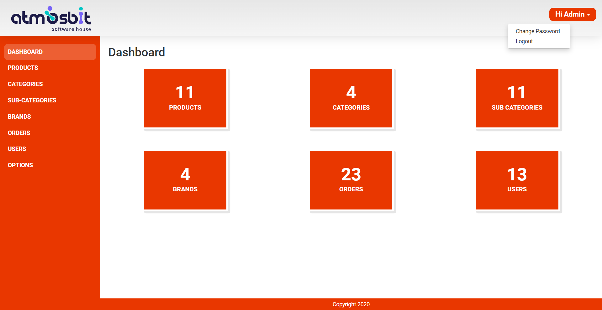

# E-commerce (PHP OOP)

 `<!-- You can add an image or screenshot of your project here -->`

## Installation Steps

1. Download the zip file and unzip it on your local server.
2. Place the unzipped folder inside "c:/wamp/www/" OR "c:/xamp/htdocs/".

## Database Configuration

1. Open phpMyAdmin.
2. Create a new database named "shopping_db".
3. Import database tables from the downloaded folder -> database -> shopping_db.sql.zip to the "shopping_db" database.
4. In "PROJECT-FOLDER/admin/php_files/database.php", update the variable `$db_name = "shopping_db"` with your database name.

## Getting Started

1. Open your browser and access the URL: `http://localhost/shopping-project/` to view the E-commerce website.
2. To access the admin panel, use the URL: `http://localhost/shopping-project/admin`.
3. Admin login details:
   - Login Id: admin
   - Password: admin

## Demo User Login Details

- Login Id: user@gmail.com
- Password: user1

## InstaMojo Payment Gateway Settings

1. Register on Instamojo website: https://www.instamojo.com or https://test.instamojo.com/
2. Obtain API Key and Auth Token on this page: https://www.instamojo.com/integrations or https://test.instamojo.com/integrations.
3. Get the PHP code from this link: https://docs.instamojo.com/docs/create-a-request.
4. Set the API Key and Auth Token on line number 19 & 20 in "PROJECT-FOLDER/instamojo.php". Also, set the API URL on line number 14.

## Technologies Used

- HTML5, CSS3, Bootstrap
- JavaScript, jQuery
- PHP (Object-Oriented Programming - OOP)
- MySQL

## Screenshots

<!-- Add more screenshots if applicable -->

## Contributions

Contributions are welcome! If you find any issues with the application or want to add new features, feel free to open a pull request.
